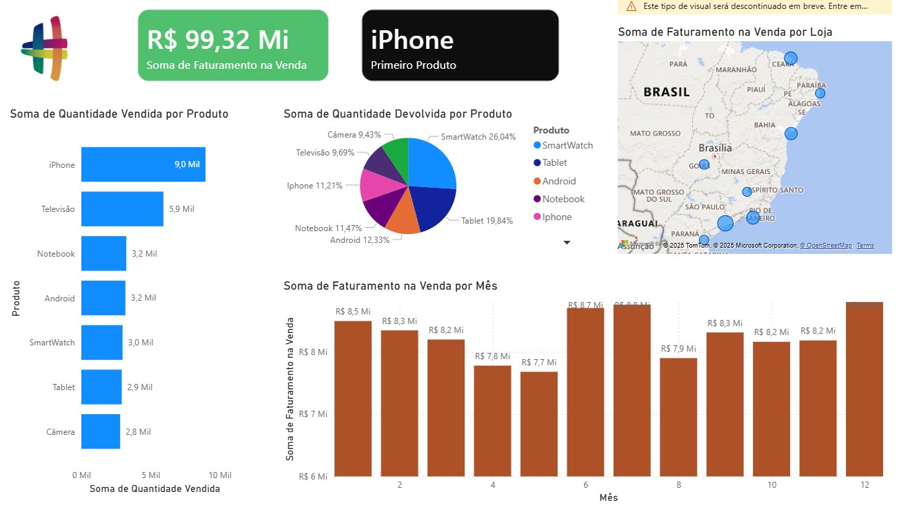

# 📊 Análise Consolidada de Vendas e Devoluções em Power BI

Este projeto demonstra a construção de um **Dashboard Interativo** de Business Intelligence (BI) no **Microsoft Power BI**, focado na análise de desempenho de vendas, faturamento e incidência de devoluções de produtos.

O objetivo principal é transformar dados brutos de fontes Excel em *insights* de negócio acionáveis, fornecendo uma visão 360º para apoiar a tomada de decisão estratégica em áreas como estoque, marketing e qualidade.

## 🖼️ Dashboard Principal

*Dashboard principal exibindo métricas de faturamento, quantidade vendida, devoluções e distribuição geográfica.*

---

## ⚙️ Detalhes Técnicos e Metodologia

### 🛠️ Ferramentas Utilizadas
* **Microsoft Power BI Desktop:** Modelagem de dados, Medidas DAX e Visualização.
* **Power Query Editor:** Processo de ETL (Extração, Transformação e Carga) e Tratamento de Dados.
* **Microsoft Excel:** Fonte de dados originais (`base_vendas.xlsx` e `base_devolucoes.xlsx`).

### 1. Fontes de Dados e Pré-processamento

O projeto se baseia na integração de dois conjuntos de dados transacionais:
* **Vendas:** Registros de faturamento, quantidade vendida e localização.
* **Devoluções:** Registros de quantidade devolvida e produto.

### 2. Tratamento e Qualidade de Dados (Power Query)

Esta fase foi crucial para garantir a **qualidade (Data Quality)** e a consistência dos dados. As principais transformações realizadas no **Power Query Editor** incluíram:

* **Enriquecimento de Dados (Coluna Calculada):**
    * Foi criada uma nova coluna calculada para determinar o **Valor Total de Venda** de cada transação, multiplicando o **Valor Unitário do Produto** pela **Quantidade Vendida**.
* **Limpeza Estrutural:**
    * Remoção de **linhas vazias** e de uma **coluna sem dados** (coluna nula), garantindo a integridade da base.
* **Consolidação de Campos:**
    * As colunas **`Nome`** e **`Sobrenome`** foram **mescladas** (concatenadas) para criar uma única coluna **`Nome Completo`** para facilitar o uso analítico.
* **Padronização de Formato:**
    * Correção de tipos: A coluna **`Data`** foi convertida de texto para o tipo **`Data`**, e o formato foi ajustado explicitamente para o **padrão brasileiro (dd/mm/aaaa)**.
    * Formato de Moeda: A coluna de **valores de vendas** foi configurada para o tipo **`Moeda (R$)`**, assegurando a representação numérica correta no painel.

### 3. Modelagem e Medidas (DAX)

Após o tratamento no Power Query, as tabelas foram carregadas para o Power BI. Para o cálculo das métricas-chave (KPIs), como o **Faturamento Total** (R$ 99,32 Mi), foram utilizadas **Medidas** construídas na linguagem **DAX (Data Analysis Expressions)**. O uso do DAX garante que as agregações de dados (como somas e porcentagens) sejam calculadas de forma dinâmica e precisa em todas as interações do relatório.

---

## 🎯 Análise e Visualizações-Chave

O dashboard foi estruturado para fornecer uma análise multifacetada, utilizando recursos de interatividade e filtragem em tempo real:

| Visualização | Tipo de Gráfico | Objetivo Analítico |
| :--- | :--- | :--- |
| **Faturamento Total & Produto Líder** | Cartões (KPI Cards) | Exibir métricas de alto nível (R$ 99,32 Mi) e o principal produto em vendas. |
| **Desempenho de Produtos** | Gráfico de Barras Empilhadas | Ranking de produtos pela **quantidade vendida**, permitindo a comparação direta de desempenho. |
| **Sazonalidade do Faturamento** | Gráfico de Colunas Agrupadas | Análise do **faturamento mês a mês**, crucial para identificar picos de demanda (e.g., meses 6 e 12) e planejar campanhas. |
| **Análise de Devoluções** | Gráfico de Pizza | Visualização da **proporção percentual de devolução** por produto, destacando áreas que exigem investigação em qualidade (e.g., SmartWatch com 26,04%). |
| **Vendas por Localização** | Mapa (Visual Geográfico) | Distribuição geográfica das vendas no Brasil, essencial para *insights* sobre logística, alcance de mercado e segmentação regional. |

### 🚀 Destaque de Interatividade

O painel foi configurado para **interação mútua**: ao selecionar um item (como um produto específico no gráfico de barras), **todos os demais visuais** (Mapa, Faturamento Mensal, e Cartões) se filtram automaticamente, possibilitando uma **análise detalhada e profunda** do item selecionado (e.g., ver onde o iPhone vendeu e como se comportou o faturamento dele mês a mês).

---

## ⬇️ Como Visualizar o Projeto

Para interagir com este dashboard, você precisará do **Microsoft Power BI Desktop** instalado em seu computador.

1.  **Baixar o Arquivo:** Você pode fazer o download do arquivo principal (`powerbi-data-analysis-sales-returns.pbix
`) diretamente pelo GitHub clicando nele e usando o botão **"View raw"** (ou "Download").
2.  **Abrir e Explorar:** Abra o arquivo `.pbix` e utilize os filtros, mapas e gráficos para explorar os dados e as análises descritas.

> **Nota:** Para quem prefere usar o terminal, o repositório pode ser clonado via `git clone`.

## 🤝 Contato

Desenvolvido por: **Wesley Santos**

| Plataforma | Link |
| :--- | :--- |
| **LinkedIn** | https://www.linkedin.com/in/itwesleysantos/ |
| **GitHub** | https://github.com/itwesleysantos |
